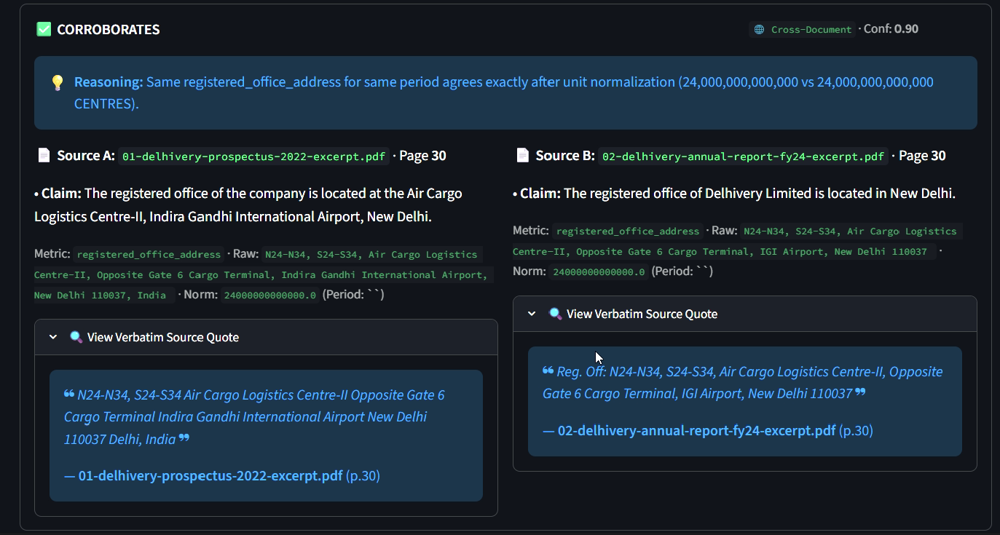
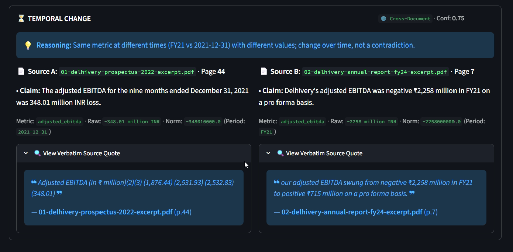
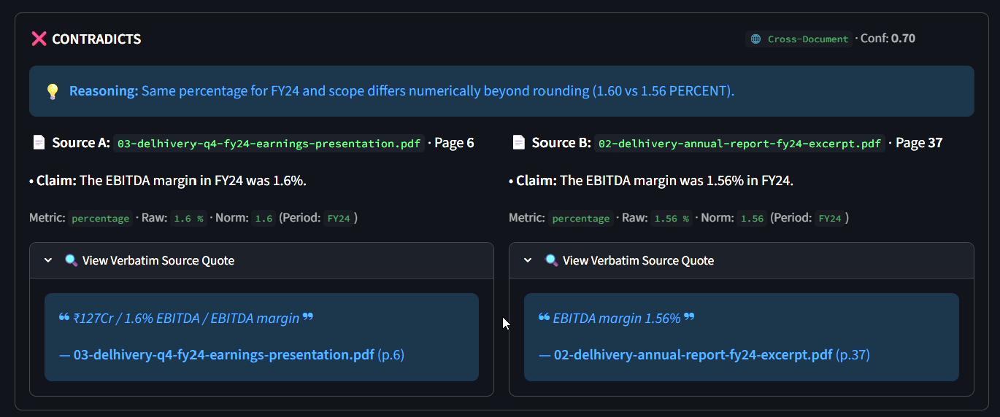
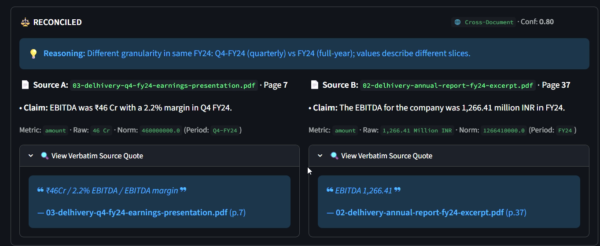
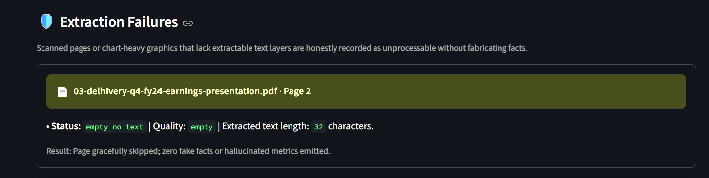

# Fact Knowledge Layer — Superjoin VIT 2026 Assignment

Provenance-first prototype: messy PDFs → structured, grounded facts → fact-to-fact
relationships (corroborate / contradict / reconcile) with evidence and explanations.
This is **not** a chatbot, summarizer, or graph-DB demo — the unit is the **fact**,
and every fact links to its source document + page + quote.

## Setup and Run

```bash
python -m venv .venv && .venv\Scripts\activate   # Windows; use source .venv/bin/activate on macOS/Linux
pip install -r requirements.txt

# 1) offline checks (no key needed — MockProvider)
python -m pytest tests/ -q
python evaluations/evaluate.py
python evaluations/verify_delhivery.py

# 2) run the UI
python -m streamlit run app.py
# open the shown localhost URL
```

Optional (real extraction + ambiguous-case judgments; free tier):

```bash
# get a free key at https://aistudio.google.com
set GEMINI_API_KEY=your_key        # Windows cmd; $env:GEMINI_API_KEY="..." in PowerShell
set GEMINI_MODEL=gemini-3.1-flash-lite  # default (verified free-tier, most RPD headroom)
set LLM_PROVIDER=gemini
python -m streamlit run app.py
```

Without a key the app runs fully offline on the mock provider (extraction returns
empty, deterministic engine + evaluations still run). No credentials are committed;
see `.gitignore` (`data/`, `*.db`, `.env` excluded).

## Video summary

> **Video link: https://drive.google.com/file/d/12QYa_BcDZ9ZJLm391LoOVJKPHEiK_koB/view?usp=sharing** (showcase screen recording, no audio)
>
> *Note: against the submission deadline I could only record the visual showcase —
> no audio or subtitles. The summary below states everything the video demonstrates.*

The video walks through the following, in order. Description first, evidence after:

**The idea.** Important facts hide across PDFs, written differently each time. This Fact
Knowledge Layer pulls out each fact with its proof — document, page, exact quote — and
links the same fact across documents: they agree, they conflict, or they agree once you
see the context. Deterministic rules decide the obvious; the LLM judges only genuine
ambiguity. Provenance over black boxes.

**Upload.** Any PDF joins the active collection (or starts a new one) and is processed
incrementally — new facts are compared against existing ones without rebuilding. Text
extracts page by page with per-page quality grading; chart-only pages are flagged as
`empty_no_text`, never fabricated. A free Gemini key powers extraction (visible in the
sidebar); without one the app runs in offline demo mode. The run behind this demo:
3 Delhivery documents, 227 pages → **1652 facts, 572 relationships**.

**Facts.** Every fact shows subject, predicate, raw + normalized value, unit, period,
scope, confidence — and the source quote below. Values normalize first: `₹8,142 Cr`
and `₹81,415 Mn` are recognized as the same number (81,420,000,000 vs 81,415,380,000)
with no LLM doing arithmetic; dates are never reduced to day-numbers. Confidence is
earned, never asserted: capped at 0.9 single-source, bumped on corroboration, nothing
at 1.0.

### Case 1 — corroborated across documents, expressed differently

Same registered office, written with different abbreviations in the 2022 prospectus
(p.30) and the FY24 annual report (p.30) — the assignment's own "differently written
addresses" example, matched with verbatim quotes on both sides.



### Case 2 — temporal change + a likely contradiction, shown honestly

Adjusted EBITDA for the nine months to Dec 2021 (−348.01 Mn) vs FY21 (−2,258 Mn):
same metric, different periods — change over time, not conflict.



The flagged likely contradiction is EBITDA margin 1.6% (deck) vs 1.56% (annual report),
same FY24 consolidated scope. On inspection this is a 0.04pp rounding difference, not a
real disagreement — it is shown as flagged-with-capped-confidence rather than hidden,
which is exactly how borderline cases should surface.



### Case 3 — apparent contradiction explained by context

EBITDA ₹46 Cr in Q4-FY24 vs ₹1,266.41 Mn in FY24: same metric, quarterly vs full-year
granularity — different slices, no conflict. Same pattern holds for revenue scope
(consolidated vs standalone) and distinct appointment events.



### Case 4 — extraction failure, handled without fabrication

Deck page 2 (and pp. 4, 18) carry no text layer — 32 extractable characters. The page is
recorded `empty_no_text` and skipped; zero facts are invented for it.




## Starter data (git-ignored, local-only)

The starter PDF excerpts are intentionally **not** in git. A fresh clone contains
code only. To run dataset-dependent checks, unzip `starter-datasets.zip` (from the
assignment bundle) so this layout exists:

```
unzipped_starter/starter-datasets/delhivery/*.pdf
unzipped_starter/starter-datasets/india-macroeconomy/*.pdf
```

Behavior without the excerpts: `pytest` runs the offline suite and **skips** the 4
dataset tests; `evaluate.py` passes fully offline; `verify_delhivery.py` exits 2
with placement instructions instead of a confusing traceback. The UI works without
them — upload any PDF to a collection.

## Reproducing the four demo cases (Delhivery)

1. Create collection `delhivery` in the sidebar.
2. Upload (Upload tab, max-pages ≈ 15 for a fast free-tier run):
   - `01-delhivery-prospectus-2022-excerpt.pdf`
   - `02-delhivery-annual-report-fy24-excerpt.pdf`
   - `03-delhivery-q4-fy24-earnings-presentation.pdf`
3. Open **Demo Cases** — cases are retrieved live from the DB, never hard-coded:
   - **1 · Corroborated:** FY24 express parcels **740 Mn** — Annual Report text/table vs Earnings deck chart (different wording, same value).
   - **2 · Contradiction / temporal change:** same metric, same scope, different values → `CONTRADICTS`; same metric across 2022→FY24 with changed value → `TEMPORAL_CHANGE` (e.g. director active in 2022 prospectus vs ceased later — judged, not rule-coded).
   - **3 · Reconciled by context:** Q3-FY24 PAT (+₹117M scale) vs FY24 full-year PAT (negative, full-year granularity), or services-only vs total revenue scope — `RECONCILED` with the differing dimension named.
   - **4 · Extraction failure:** chart-heavy earnings-deck pages have empty/low text layers — recorded as `empty_no_text`/`low_text` with no fabricated facts.
4. Click any fact → evidence quote + document/page; related facts show the reason.

`python evaluations/verify_delhivery.py` checks these five behaviors against the real
excerpt texts offline (evidence presence + deterministic decisions + low-text surface).

## Approach / Architecture

```
PDF → hash → page text (PyMuPDF) → quality → LLM extract (1 call/page, JSON) →
validate+ground → normalize (deterministic) → persist fact+evidence →
selective candidates → deterministic decide → LLM judge ONLY if ambiguous →
persist relationship → Streamlit inspect
```

- **PDF processing (local):** page-aware PyMuPDF extraction with `good/low/empty`
  quality, page-text cache on disk, per-page statuses (`page_processing`) so one bad
  page never kills a 100-page doc and retries don't restart the doc.
- **LLM provider boundary (`src/llm.py`):** `LLMProvider` interface + `GeminiProvider`
  (REST, JSON mode, retry/backoff on 429/5xx, disk cache) + `MockProvider` (offline).
  Verified Sept 2026: Gemini API keeps a **$0 Free Tier** on eligible Flash models
  with per-project RPM/RPD caps — hence one small page-slice call at a time, never
  whole-PDF prompts. App logic never imports vendor SDKs; `LLM_PROVIDER`/`GEMINI_API_KEY`
  configure it. See `docs` in `src/llm.py` header.
- **Fact extraction (generic):** single page-slice prompt, max 12 facts, strict JSON
  schema `{subject, predicate, value_raw, unit_raw, period_raw, scope, qualifiers,
  claim, confidence, evidence_quote}`. Validation drops incomplete rows; quotes that
  don't overlap the source get confidence ×0.6 instead of false certainty.
  No filename/page/value rules anywhere.
- **Provenance (first-class):** `evidence(fact_id, document_id, page, text)`; UI shows
  claim + normalized value + source file/page/quote for every fact.
- **Normalization (deterministic, `src/normalize.py`):** Indian + SI scales
  (lakh/crore/Mn/Bn), ₹/INR→absolute, % passthrough, `740 Mn→740,000,000`,
  `₹8,142 Cr≈₹81,420 Mn` (agrees with `₹81,415 Mn` within 0.1%),
  periods `FY 2023-24→FY24`, `Q4 FY24→Q4-FY24`, `March 31, 2024→2024-03-31`.
  Raw values/claims preserved; LLM never does arithmetic.
- **Candidate retrieval (`src/retrieve.py`):** predicate/subject compatibility +
  unit match filter, ranked (predicate > subject > period > cross-doc), capped at 20.
  Scope defaults to current collection; `selected`/`all` still filter selectively —
  enabling cross-collection never means all-vs-all. Hybrid semantic retrieval
  (`SemanticIndex` over `fact_embeddings`, model locked to `gemini-embedding-2`) is
  implemented and gated: lexical ∪ cosine candidates, deduped, structured rerank —
  embeddings propose, deterministic math disposes, LLM judges only cross-doc ambiguity.
- **Relationship reasoning (`src/relate.py`):** deterministic ladder first —
  granularity check (Q3-FY24 vs FY24 → `RECONCILED`), same-period value compare
  within 2% (`CORROBORATES`, percent-aware rounding), scope-explained gaps
  (`RECONCILED`), cross-period numeric change (`TEMPORAL_CHANGE`), same-period conflict
  (`CONTRADICTS`) — then `llm_judge` (facts + evidence snippets only) for semantic/ambiguous pairs.
  Guards learned from real data: different entities never blind-contradict, non-identical
  subjects under generic predicates (e.g. balance-sheet line items) defer instead of false
  contradiction, dates are never day-number arithmetic, diff-predicate pairs need agreeing
  values/periods, LLM judges cross-document pairs only. Single entry point `classify_pair`.
  Vocabulary is extensible data; demo values are not rules.
- **Confidence is earned, not asserted:** single-source facts capped at 0.9 with
  quote-strength adjustments; corroboration bumps to 0.95; nothing reaches 1.0.
- **Incremental (`src/pipeline.py`):** content-hash dedup (re-upload = reuse),
  only **new** facts are compared against relevant existing ones; jobs table tracks
  runs. Large PDFs handled by page slicing + `max_pages` cost control.
- **Comparison scope:** one DB, many collections; `resolve_scope(current|selected|all)`;
  no `if collection == ...` logic exists in the codebase.
- **Storage:** SQLite is the source of truth
  (`collections, documents, facts, evidence, relationships, processing_jobs,
  page_processing`); predicates/relationship types are rows, not columns, so the
  schema evolves as new fact kinds appear. No graph DB — the relationships table
  *is* the graph; visualization is presentation. Page texts + LLM cache live under
  `data/` (git-ignored).

## Data model (key fields)

- `facts`: `subject, predicate, value_raw, value_norm, unit_raw, unit_norm,
  period_raw, period_norm, scope, qualifiers(JSON), claim, confidence`
- `evidence`: `fact_id, document_id, page, text`
- `relationships`: `fact_a_id, fact_b_id (canonical order), type, confidence,
  reason, dimensions(JSON)` — fact-to-fact, never doc-to-doc.

## Provider configuration / environment

| var | default | meaning |
|---|---|---|
| `LLM_PROVIDER` | `mock` (auto→keyed provider) | `mock` \| `gemini` \| `groq` |
| `GEMINI_API_KEY` | — | free key from AI Studio; required for real LLM |
| `GEMINI_MODEL` | `gemini-3.1-flash-lite` | verified free-tier, most RPD headroom |
| `GROQ_API_KEY` | — | free key from console.groq.com |
| `GROQ_MODEL` | `llama-3.3-70b-versatile` | 30 RPM / 1000 RPD; fallback `llama-3.1-8b-instant` (14.4K RPD) |
| `APP_DB` | `data/app.db` | SQLite path |
| `DATA_DIR` | `data/files` | page-text cache |

Cost strategy: local parsing + deterministic math + capped candidates + tiny
page-slice prompts + response cache + LLM-only-when-ambiguous. A 3-doc × 15-page
demo fits comfortably in free-tier quotas (429s are retried with backoff).

## Tests / evaluation

```bash
python -m pytest tests/ -q          # 79 tests; 4 dataset tests skip without local excerpts
python evaluations/evaluate.py      # 19 offline checks from expected_cases.json (never imported by prod code)
python evaluations/verify_delhivery.py  # real-PDF evidence + decision verification
python evaluations/retrieval_precision.py --db data/run_delhivery.db  # hand-label scorecard (read-only, offline)
```

## Limitations and Next Steps

- Measured honesty: hand-labeled scorecard (`evaluations/relationship_labels.json`,
  130 pairs) grades exact-match **30%**, macro-F1 45% — strong on temporal/reconciled,
  over-eager on contradictions (rounding, generic predicates, thin qualifiers).
  The scorecard, not eyeballing, gates further tuning.
- Text-layer only: scanned/chart pages yield `empty/low` honestly; **vision fallback**
  (render page → multimodal extract → same schema + confidence) is the top next step —
  failure taxonomy in `src/failures.py` already reserves the path.
- Mock offline mode extracts nothing (by design — no fabrication); needs key for live facts.
- 300+ facts lack periods; sparse DATE linkage — caps temporal recall; documented, accepted.
- No bboxes yet (quotes + page numbers only), no multi-user auth, single SQLite file.
- Next: qualifier backfill → embedding precision (period/unit prefilter is in, needs re-gate) →
  vision fallback → eval on india-macroeconomy set → batched background jobs.

## Additional Notes

- AI tools used: coding agent for scaffolding/tests; Gemini free tier for extraction/judge design.
- `evaluations/expected_cases.json` contains representative values for tests only —
  production code has zero starter-PDF rules (grep for filenames to confirm).
- Sample flow for graders without a key: run pytest + both evaluation scripts, then
  use the UI with the mock provider to inspect pipeline states, or set the free key
  for the full 4-case demo.
